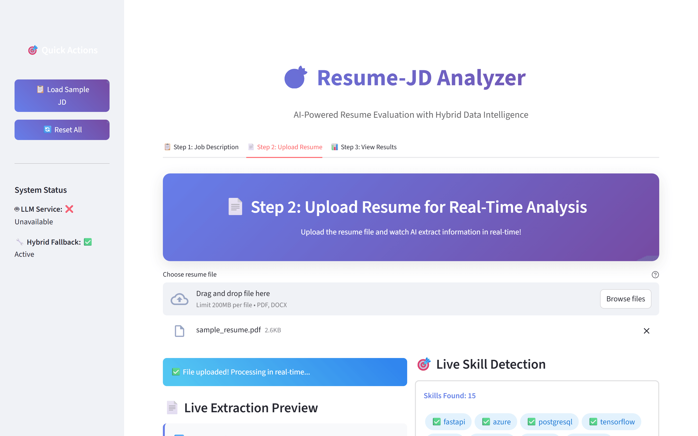
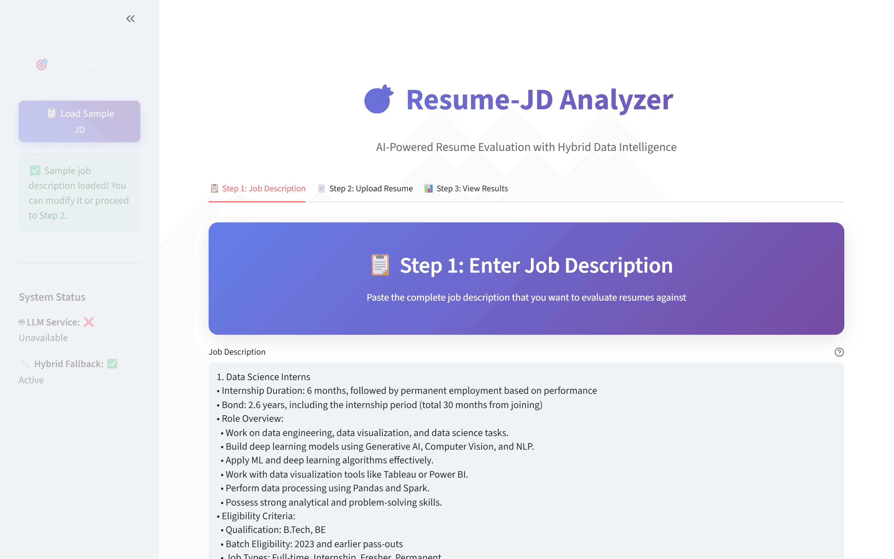
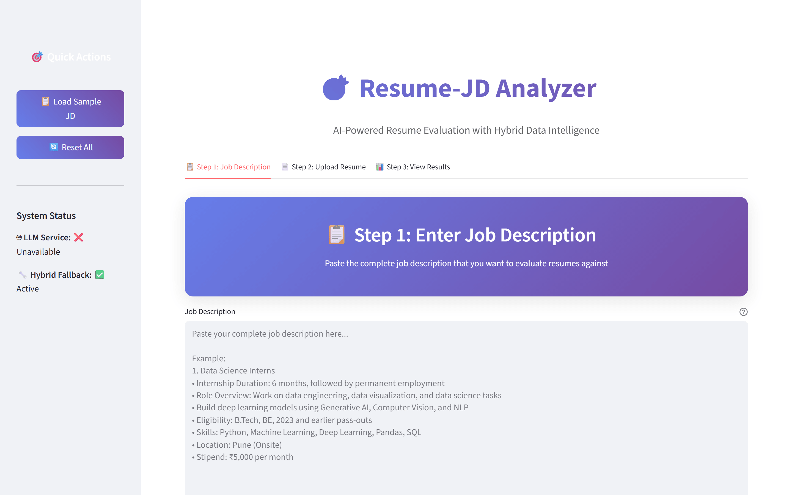

# code4ed-resume-analyser

> Scores a resume against a job description and names the specific skills that are
> missing, for placement teams triaging more applications than they can read.

**36th of 1037 teams — Code4Edtech Challenge, Innomatics Research Labs.**




## The problem

A placement cell receives a few thousand resumes against a few dozen roles. Nobody
reads them all, so the triage happens by keyword search — and keyword search is
exactly the wrong tool for this.

Resumes and job descriptions describe the same work in different vocabularies. A JD
asks for "containerisation"; the resume says "Docker". The JD wants "RDBMS
experience"; the resume lists "PostgreSQL". Exact matching misses both, and the
candidate is filtered out for a skill they have. Push the other way and use pure
embedding similarity, and the opposite failure appears: everything looks vaguely
related to everything, a resume full of adjacent-sounding language scores well, and
the ranking stops discriminating.

There is a second problem underneath the first. A score on its own is not
actionable. A student told they scored 62 learns nothing they can act on. A student
told they are missing Docker, Kubernetes and CI/CD experience for this specific
role has a list they can work through. The output has to be a gap, not a grade.

## Approach

Scoring is **hybrid** rather than committing to either failure mode.

- **Hard match** — exact keyword overlap, TF-IDF cosine similarity and fuzzy string
  matching over the JD's extracted requirements. This is what catches a resume that
  genuinely names the required tools, and it is cheap and explainable.
- **Soft match** — embedding similarity over a vector store, which catches the
  Docker/containerisation case that exact matching drops.

The two are combined with configurable weights — `KEYWORD_WEIGHT` (0.4) and
`SEMANTIC_WEIGHT` (0.6) — so the balance is a deployment decision rather than a
hardcoded assumption. Weighting semantic higher acknowledges that vocabulary
mismatch is the more common failure, while keeping a hard-match floor that a purely
semantic score would lose.

**The output is a skill gap, not just a number.** The matcher tracks which JD
requirements were satisfied and by what, so an unmatched requirement is reported as
a named missing skill rather than disappearing into an aggregate.

### Degrading without a language model

The LLM layer is optional by design. When `GOOGLE_API_KEY` is absent the app reports
`LLM Service: Unavailable / Hybrid Fallback: Active` in the sidebar and continues on
the deterministic path — parsing, keyword matching, TF-IDF, fuzzy matching and
vector similarity all run locally. The language model adds narrative feedback; it is
not load-bearing for the score. A placement cell without an API budget still gets a
working triage tool, which is the point.

## Features

| Capability | How it works |
|---|---|
| PDF and DOCX parsing | `pdf_parser` and `docx_parser` with a `docx2txt` fallback when python-docx yields nothing |
| Hard match | Exact keyword overlap, TF-IDF cosine similarity and fuzzy matching via `fuzzywuzzy` |
| Soft match | Embedding similarity over a vector store for vocabulary-mismatched requirements |
| Weighted relevance score | Configurable hard/soft weights, defaulting to 0.4 / 0.6 |
| Skill-gap output | Unmatched JD requirements surfaced as named missing skills |
| Live extraction preview | Skills detected and displayed as the file is parsed, before scoring completes |
| Graceful LLM fallback | Full deterministic pipeline when no API key is configured |
| Batch processing | Multiple resumes scored against one saved job description |

## Screenshots

### Job description



Step 1 accepts a pasted JD, or loads the bundled sample. The JD is saved before any
resume is uploaded, so one description can be reused across a batch.

### Live extraction


Step 2 with a synthetic test resume uploaded. Skills are detected and shown as the
document is parsed — 15 found here, including `fastapi`, `azure`, `postgresql` and
`tensorflow`. The sidebar shows the LLM service unavailable and the hybrid fallback
active; extraction is unaffected.

### Entry point



The three-step flow is explicit rather than a single upload box, because the JD is
the reusable half of the pair.

## Architecture

```
resume (PDF / DOCX)            job description (text)
        │                              │
        ▼                              ▼
   file_parser                   text_processor
   pdf_parser / docx_parser      requirement extraction
        │                              │
        └──────────────┬───────────────┘
                       ▼
              ┌────────────────────┐
              │  hard match        │  exact keywords · TF-IDF · fuzzy
              │  soft match        │  vector-store embedding similarity
              └─────────┬──────────┘
                        ▼
              scorer  (0.4 · hard + 0.6 · soft)
                        │
                        ├──► relevance score
                        └──► named missing skills

              llm_service ─ optional narrative feedback
                            (skipped entirely when no key is set)
```

Parsing, matching and scoring are separate services under `app/services/`, so the
LLM layer can be removed from the path without touching the scoring logic. That
separation is what makes the keyless fallback a configuration state rather than a
degraded code path.

## Tech stack

| Layer | Technology | Why |
|---|---|---|
| UI | Streamlit | A placement cell needs a URL, not a deployment; Streamlit gets there in one file |
| Parsing | pdfplumber, python-docx, docx2txt | Two independent DOCX paths because real resumes are inconsistently authored |
| Matching | scikit-learn, fuzzywuzzy | TF-IDF and cosine similarity are the right tools and are explainable |
| Embeddings | Vector store over sentence embeddings | Catches vocabulary mismatch that exact matching drops |
| LLM | Google Gemini via LangChain | Narrative feedback only; the score never depends on it |
| Storage | SQLite | Saved job descriptions and evaluation history; no server to run |

## Getting started

### Prerequisites

- Python 3.11
- No API key required — the app runs fully on its deterministic path without one

### Installation

```bash
git clone https://github.com/varadharajanv0310/code4ed-resume-analyser.git
cd code4ed-resume-analyser

python -m venv .venv
.venv/Scripts/python -m pip install -r requirements.txt   # Windows
# .venv/bin/pip install -r requirements.txt               # macOS / Linux
```

### Configuration

Optional. Copy `.env.example` to `.env` only if you want the language-model layer.

| Variable | Required | Default | Purpose |
|---|---|---|---|
| `GOOGLE_API_KEY` | No | — | Gemini narrative feedback. Absent, the app runs its hybrid fallback. |
| `KEYWORD_WEIGHT` | No | `0.4` | Weight of the hard-match component |
| `SEMANTIC_WEIGHT` | No | `0.6` | Weight of the soft-match component |
| `MIN_RELEVANCE_SCORE` | No | `30` | Threshold below which a resume is marked not relevant |
| `MAX_FILE_SIZE_MB` | No | `10` | Upload size limit |
| `ALLOWED_EXTENSIONS` | No | `pdf,docx` | Accepted upload types |
| `LANGCHAIN_API_KEY` | No | — | LangSmith tracing, off by default |

### Running

```bash
.venv/Scripts/python -m streamlit run app/main.py
```

The app serves on `http://localhost:8501`. Load the sample JD from the sidebar,
save it, then upload a resume in step 2.

## Project structure

```
code4ed-resume-analyser/
├── app/main.py           # Streamlit entry point — the three-step flow
├── app/services/         # parsers, keyword_matcher, scorer, vector_store, llm_service
├── app/pages/            # additional Streamlit pages
├── app/models/           # data models for evaluations and job descriptions
├── config/               # application settings
└── test_*.py             # unit tests for matcher, scorer, text processing, vector store
```

## Limitations

- **No accuracy evaluation.** There is no labelled set of resume/JD pairs with
  ground-truth relevance in this repository, so the weighting (0.4 / 0.6) is a
  reasoned default rather than a tuned one. No accuracy figure is claimed because
  none has been measured.
- **English only.** Parsing and matching assume English resumes and descriptions.
- **Skill extraction is vocabulary-bound.** A skill the extractor does not know
  cannot be reported as present or missing.
- **Formatting-sensitive parsing.** Multi-column and heavily designed resume
  templates degrade text extraction, which degrades everything downstream.
- **Not bias-audited.** The system has not been tested for differential behaviour
  across candidate demographics, which is a prerequisite for real screening use.
- **Hackathon scope.** Built in the challenge window; there is no authentication,
  no multi-tenancy and no audit trail on decisions.

## Roadmap

- A labelled evaluation set so the hard/soft weighting can be tuned rather than assumed
- Bias audit across name, gender and institution signals before any real screening use
- Structured section parsing (education, experience, projects) rather than flat text
- Explanation of *why* each requirement matched, surfaced next to the score
- Export a batch ranking as CSV for placement-cell workflows

## Team

Built for the Code4Edtech Challenge by Innomatics Research Labs, as Team F8 —
**V Varadharajan** and **A Sowmiya Priya**. Placed **36th of 1037 teams**.
